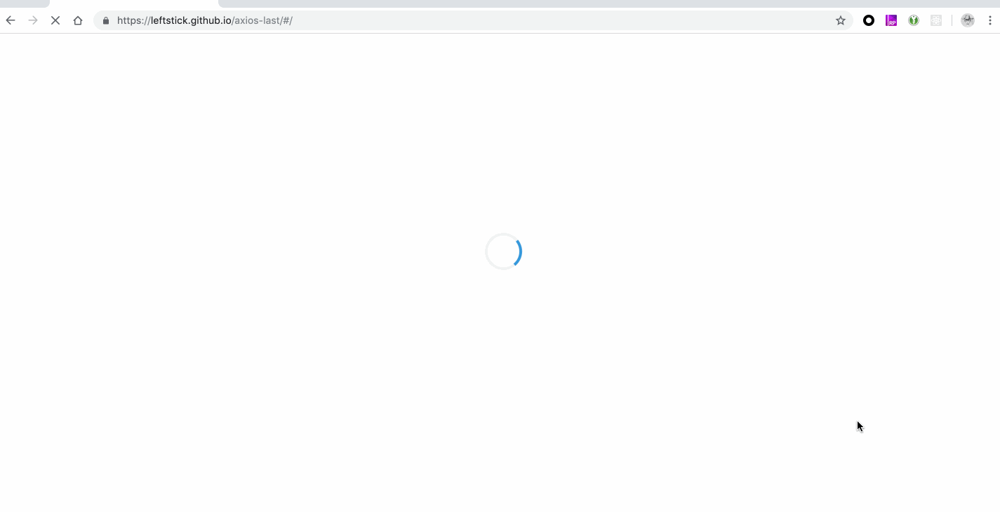

# docz-plugin-splash

[![NPM version][npm-image]][npm-url]
![][david-url]
![][dt-url]
![][license-url]

Docz plugin to enable splash spinner before static assets load, and destroy the spinner after the doc actually rendered




## Installation

First of all, install plugin:

```bash
$ yarn add docz-plugin-splash --dev
```

After that, use the plugin on your `doczrc.js`:

```js
// doczrc.js
import { splash } from 'docz-plugin-splash'

export default {
  plugins: [
    splash()
  ]
}
```

>This is all you need to do, `docz-plugin-splash` will do the rest


## LICENSE

[MIT License](https://raw.githubusercontent.com/leftstick/docz-plugin-splash/master/LICENSE)

[npm-url]: https://npmjs.org/package/docz-plugin-splash
[npm-image]: https://badge.fury.io/js/docz-plugin-splash.png
[david-url]: https://david-dm.org/leftstick/docz-plugin-splash.png
[dt-url]: https://img.shields.io/npm/dt/docz-plugin-splash.svg
[license-url]: https://img.shields.io/npm/l/docz-plugin-splash.svg
